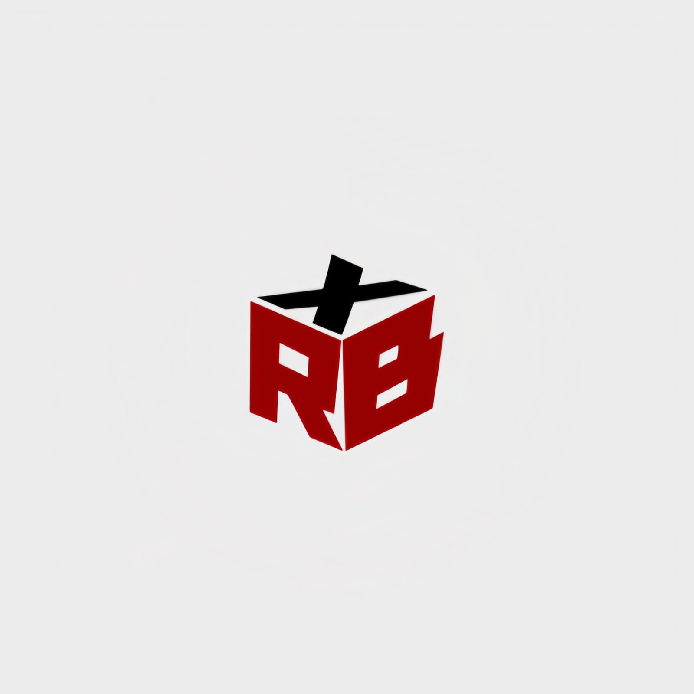
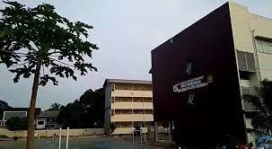
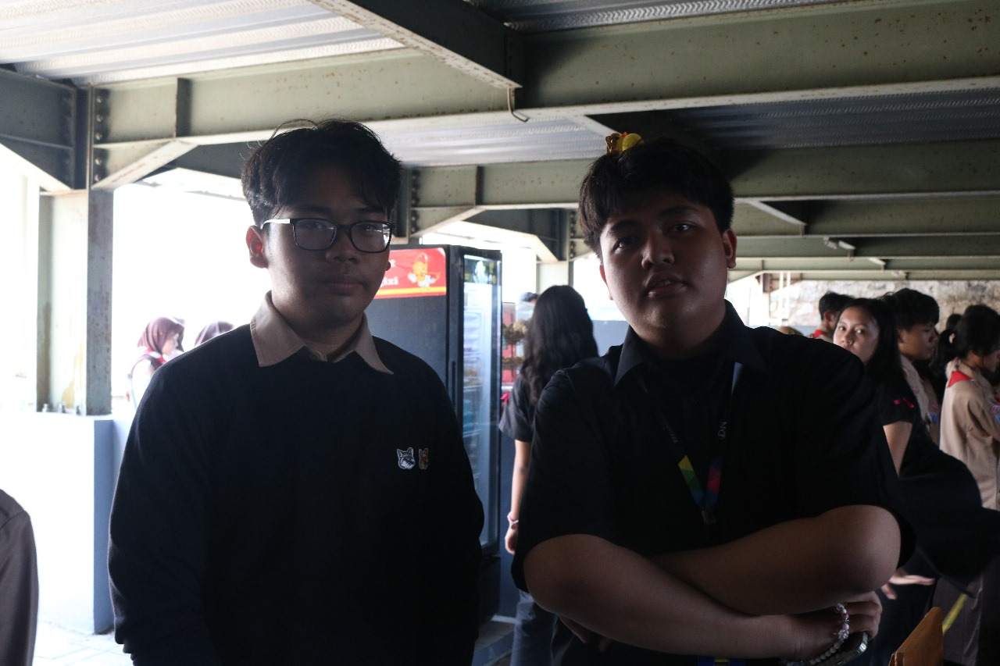
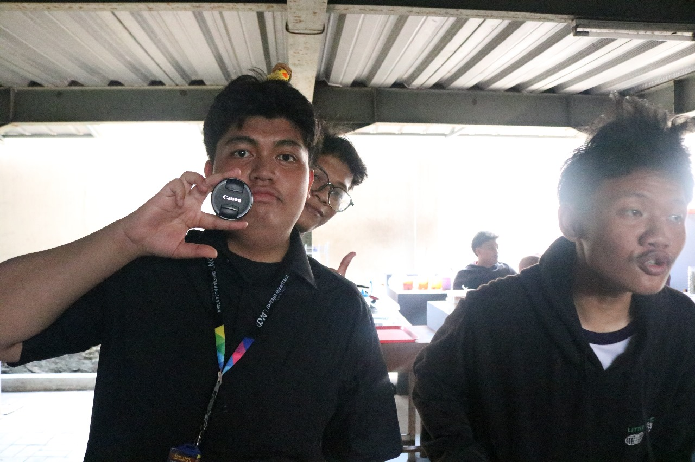
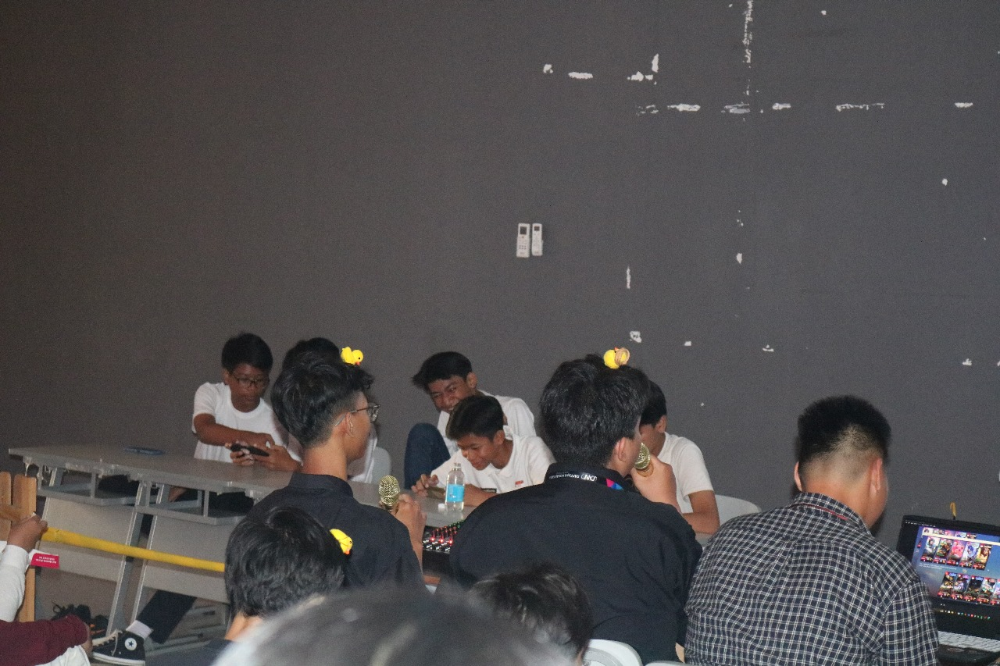
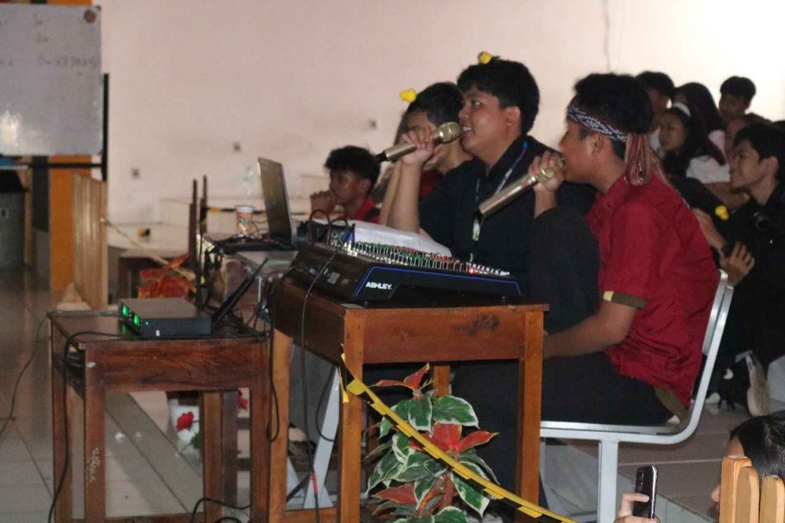

# RedBox Community
  Komunitas E-sports SMK Letris Indonesia 2 yang bernama "RedBox" adalah sebuah kelompok yang dibentuk dengan tujuan untuk mengumpulkan siswa-siswi yang memiliki minat dan bakat dalam bidang E-sports.

Komunitas ini bertujuan untuk memberikan wadah positif dan terstruktur bagi para anggotanya dalam mengembangkan keterampilan dan kompetensi mereka di dunia
e-sports, khususnya dalam permainan Mobile Legends.



## FILOSOFI LOGO REDBOX
Kata "RBX" berasal dari kata "RedBox," yang berarti Kotak Merah. Nama ini diambil dari konsep bangunan SMK Letris Indonesia 2, yang memiliki warna kemerahan yang khas. Warna merah pada bangunan ini melambangkan semangat, keberanian, dan energi yang menjadi ciri khas dari sekolah tersebut.



## STRUKTUR Kepengurusan Ekstrakurikuler Esport Mobile Legends Periode 2024/2025

```
Pembimbing
- Bagus Adhy Pratama
- Ahmad Rifaldi, S.Kom

Ketua
- Rafa Agusta Putro Harsono

Wakil Ketua
- Israruddin

Sekretaris 
- Alim Wijaya
- Rifa Auralia

Bendahara 
- Adam Sega
(Rp. 10.000 / bulan)

Dokumentasi 
- fotografi
1. Kevin Mario Raga
2. Muhammad Faiz Putra Perdana 
- videografi
1. Martin Steven Alexander
2. Yusuf Raditya Pratama
3. Chaves Julio Alexandra

Manager TimNas Letris 2 (RedBox)
- Sahid Anwar, S.Pd

Assisten TimNas manager
- Niko Christian

Talent + perbantuan OSIS 
1. Nasya Damica Azzahra
2. Natasha Hendra
3. Arkananta Ulayya
4. Safira Azzahra

sie. umum
1. Kevin Zidane
2. Aldeyo Raif Anaqi
3. Vemitha Annas Tasya
4. Matthew Alexander Joshua Mambu
```

# Dokumentasi Lomba Agustusan Mobile Legends 

- Day 1 (14 Agustus 2024)



## 

### 

- Day 2 (15 Agustus 2024)



## 